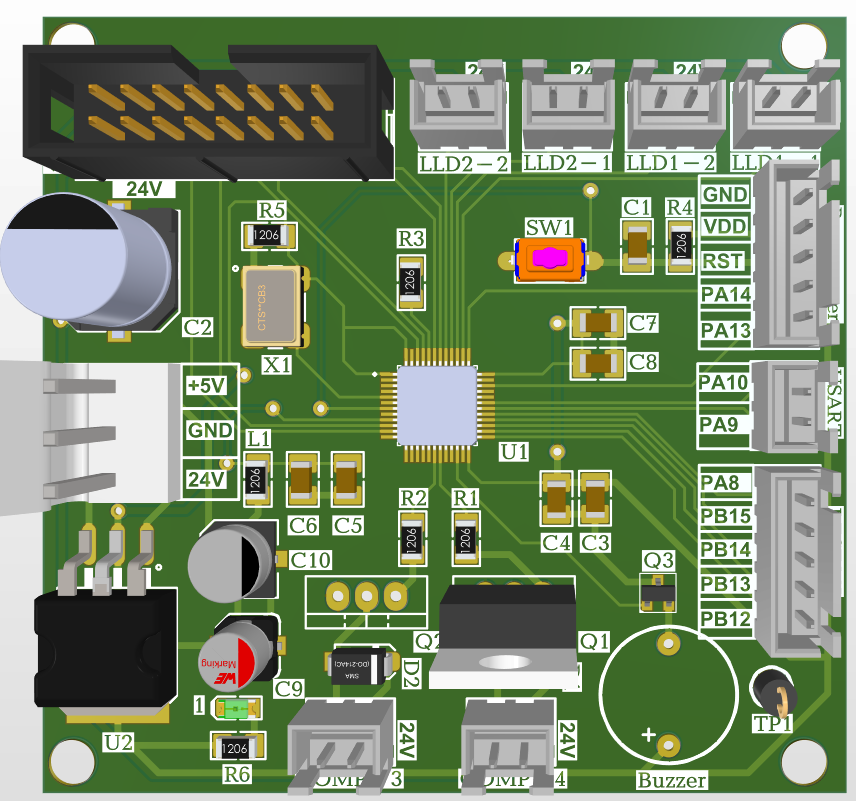
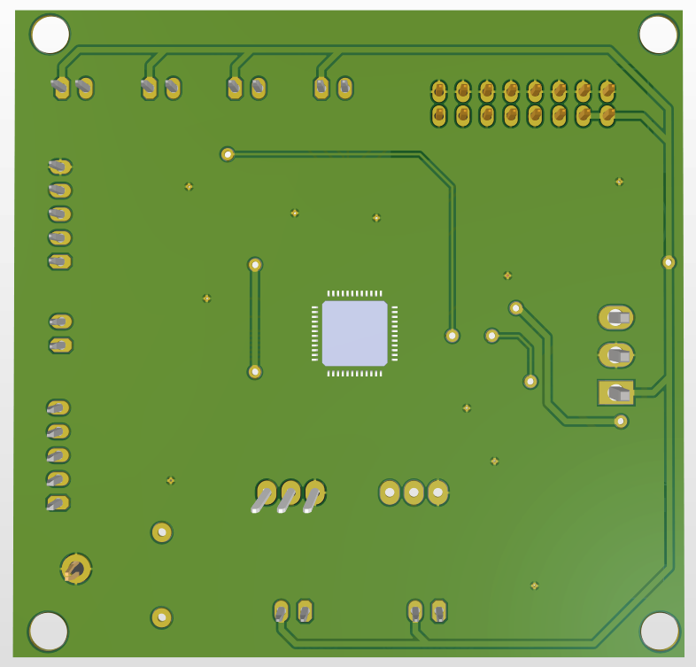
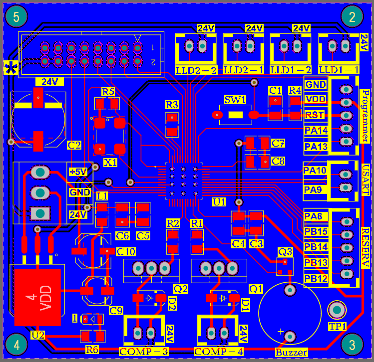
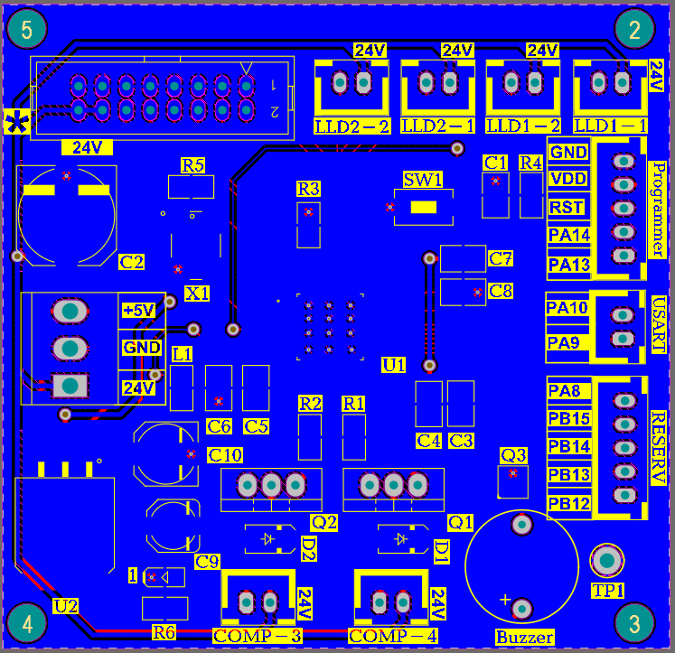

# Laboratory Chemiluminescence 

Altium Designer PCB layout, schematic, and Bill of Materials (BOM) for a laboratory luminescence analysis and liquid control module based on an STM32 microcontroller, featuring precision liquid level detection (LLD), actuator control, and dedicated sensor buses.

## 🛠️ Features & Specifications

* **Microprocessor Core (U1):** STM32 32-bit ARM Cortex-M microcontroller with SWD programming interface (`Programmer`)
* **Power Management:** On-board 24V DC main power input with integrated +5V regulation (`U2`) and decoupling networks
* **Liquid Level Detection (LLD):** 4-channel dedicated liquid level sensor inputs (`LLD1-1`, `LLD1-2`, `LLD2-1`, `LLD2-2`) for reagent/sample monitoring
* **Actuator & Driver Outputs:**
  * Power MOSFET / Transistor drivers (`Q1`, `Q2`, `Q3`) with protection diodes (`D1`, `D2`) for switching pumps/compressors (`COMP-3`, `COMP-4`)
  * Piezoelectric Buzzer (`Buzzer`) for status, timing, and error indicators
* **Communication & Control Bus:**
  * Dedicated USART communication header (`PA9`, `PA10`) for interfacing with main unit or PC
  * Auxiliary GPIO breakout (`RESERV`: `PA8`, `PB12`-`PB15`) for optical/photomultiplier sensor triggers
  * Main system ribbon cable header

---

## 📁 Repository Structure

* 📄 `Schematic_Diagram.pdf` — Full Circuit Schematic Diagram
* 📊 `BOM_List.xlsx` — Complete Bill of Materials (Component List)
* 🖼️ `3d_top_view.png` — 3D PCB Render (Top View)
* 🖼️ `3d_bottom_view.png` — 3D PCB Render (Bottom View)
* 🖼️ `pcb_layout_top.png` — PCB Top Layer Copper & Silkscreen
* 🖼️ `pcb_layout-bottom.png` — PCB Bottom Layer Copper & Silkscreen

---

## 📑 Previews & Documentation

| Schematic Diagram | Bill of Materials (BOM) |
| :---: | :---: |
| 📄 [Download Schematic PDF](./Schematic_Diagram.pdf) | 📊 [View Bill of Materials (BOM)](./BOM_List.xlsx) |

---

## 🖼️ Visuals

### 3D Model Render

| Top View | Bottom View |
| :---: | :---: |
|  |  |

### PCB Layout Design

| Top Layer | Bottom Layer |
| :---: | :---: |
|  |  |
